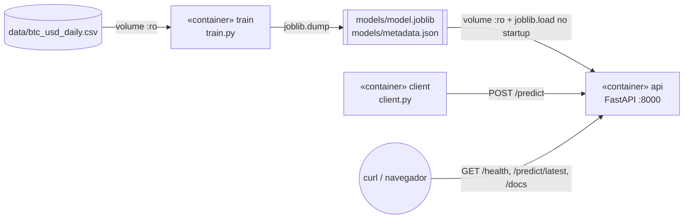

# Atividade Semana 10 Módulo 07
Nicolli Venino Santana

> ⚠️ As predições deste projeto são **experimentais** e **não** são recomendação de investimento.

## Contexto:

O objetivo da atividade é construir uma solução conteinerizada que **treina um modelo para estimar o valor futuro de uma moeda** (aqui, **Bitcoin em dólar, BTC-USD**) a partir de dados históricos. O modelo treinado é disponibilizado em **um segundo container**, com um backend em Python que o carrega e responde a pedidos de predição. O foco não é acertar o preço, e sim mostrar a integração entre treinamento, artefato do modelo, container de inferência e aplicação cliente.

| Definição | Escolha |
|---|---|
| Moeda | BTC-USD |
| Fonte | Bitstamp, diário, via [CryptoDataDownload](https://www.cryptodatadownload.com/cdd/Bitstamp_BTCUSD_d.csv) |
| "Banco de dados" | arquivo CSV: `data/btc_usd_daily.csv` (4.328 dias, de 2014-11-28 a 2026-10-04) |
| Frequência | diária |
| Horizonte | **1 dia**: preço de fechamento do dia seguinte |
| Período usado no modelo | 2018-01-01 em diante |
| Divisão treino/teste | cronológica, 80/20, sem embaralhar |

## A solução funciona como:

### Arquitetura

O UML completo (componentes, sequência e módulos) está em [`docs/arquitetura.md`](docs/arquitetura.md). Resumo:



**Como o modelo chega ao container de inferência:** o container `train` grava o artefato na pasta `./models` do host, que é um *bind mount*. O container `api` monta essa mesma pasta como somente leitura (`./models:/app/models:ro`) e carrega `model.joblib` ao iniciar. O artefato **não é copiado para dentro da imagem** da API. Assim, se o modelo for treinado de novo, basta reiniciar a API para ela usar a versão nova, sem rebuild. O `docker-compose.yml` garante a ordem com `depends_on: condition: service_completed_successfully`, ou seja, a API só sobe depois que o treino terminou com sucesso.

### Estrutura do repositório

```
├── data/btc_usd_daily.csv      # "banco de dados" (CSV)
├── common/features.py          # engenharia de atributos COMPARTILHADA (treino e API)
├── training/                   # container de treinamento
│   ├── Dockerfile
│   ├── requirements.txt
│   └── train.py
├── backend/                    # container de inferência (Python/FastAPI)
│   ├── Dockerfile
│   ├── requirements.txt
│   └── app.py
├── client/                     # aplicação cliente (Python/requests)
│   ├── Dockerfile
│   └── client.py
├── models/                     # artefato gerado (model.joblib + metadata.json)
├── docs/arquitetura.md         # diagramas UML
├── docs/evidencias/            # saídas reais dos comandos executados
└── docker-compose.yml
```

### Modelo

- **Alvo:** log-retorno do dia seguinte, `ln(close[t+1] / close[t])`. O preço previsto é `close[t] * exp(pred)`. Prever o retorno, e não o preço absoluto, evita que o modelo precise extrapolar preços que nunca viu: o BTC saiu de cerca de US$ 13 mil em 2018 para mais de US$ 80 mil em 2026.
- **Atributos** (13, calculados só com o preço de fechamento numa janela de 30 dias): log-retornos defasados de 1 a 7 dias, média dos retornos em 7 e 30 dias, volatilidade (desvio padrão) em 7 e 30 dias e a distância do preço até as médias móveis de 7 e 30 dias.
- **Candidatos:** `Ridge` (com `StandardScaler`) e `GradientBoostingRegressor`, comparados com o **baseline ingênuo** "amanhã = hoje".
- **Seleção:** menor MAE em US$ no conjunto de teste. O modelo vencedor é treinado de novo com todo o histórico antes de ser exportado.
- **Formato do artefato:** `joblib`, um pipeline scikit-learn, mais `metadata.json` com as métricas, os períodos e a lista de atributos.

### Endpoints do backend

| Método | Rota | Descrição |
|---|---|---|
| GET | `/health` | verificação de vida (`{"status":"ok","model_loaded":true}`); também usada pelo `HEALTHCHECK` do Docker |
| GET | `/model` | metadados do modelo carregado (métricas, períodos, atributos) |
| POST | `/predict` | recebe `{"closes": [...≥31 fechamentos], "last_date": "YYYY-MM-DD"}` e devolve o fechamento previsto para o dia seguinte |
| GET | `/predict/latest` | lê os últimos 31 dias do CSV e prevê o dia seguinte ao último registro |
| GET | `/docs` | Swagger UI, gerada pelo FastAPI |

### Como reproduzir

Pré-requisito: Docker com Docker Compose. Não é preciso ter Python instalado no host.

```bash
# 1. treina o modelo (container train) e sobe a API (container api)
docker compose up --build -d
#    se a porta 8000 estiver ocupada:  API_PORT=8080 docker compose up --build -d
#    (no PowerShell:  $env:API_PORT=8080; docker compose up --build -d)

# 2. confere status e logs
docker compose ps -a
docker compose logs train
docker compose logs api

# 3. testa a API
curl http://localhost:8000/health
curl http://localhost:8000/predict/latest
# navegador: http://localhost:8000/docs

# 4. roda a aplicação cliente
docker compose --profile client run --rm client

# (opcional) treina de novo e recarrega o modelo na API
docker compose run --rm train && docker compose restart api

# 5. derruba tudo
docker compose down
```

### Limitações conhecidas

- **O modelo não supera o baseline ingênuo.** No teste (2025-01-01 a 2026-10-03), o Ridge teve MAE de US$ 1.406,06 contra US$ 1.399,45 do "amanhã = hoje", e acertou a direção em 49,4% dos dias, o que equivale a um cara ou coroa. Isso é esperado: o preço diário do BTC se comporta quase como um passeio aleatório. A previsão tende a ficar muito próxima do último preço.
- Só usa o preço de fechamento. O volume foi descartado porque as colunas de volume do CSV de origem aparecem invertidas em parte do histórico (veja o devlog).
- O CSV é um retrato estático, baixado em 2026-10-05. Para prever dias novos é preciso atualizar o CSV e treinar de novo. Não há coleta automática.
- O horizonte é fixo em 1 dia, e não há intervalo de confiança.
- A API não tem autenticação nem limite de requisições, e roda com um único worker. Serve para demonstração, não para produção.

---

## Devlog:

### 1. Entendimento e decisões iniciais

- Li o enunciado (`instruções.md`). Para manter o foco nos containers, decidi usar **um arquivo CSV como banco de dados**, como o próprio enunciado recomenda.
- Python não estava instalado no host, mas Docker 29.8 e Compose v5.5 estavam. **Decisão:** rodar *tudo* em containers (treino, API e cliente). Isso também ajuda na reprodutibilidade.
- **Fonte de dados:** o Yahoo Finance respondeu `HTTP 429 Too Many Requests` no teste de conexão. Por isso usei o CSV diário da Bitstamp no CryptoDataDownload, que respondeu `200 OK` e não precisa de API key.
- **Stack:** pandas, scikit-learn e joblib no treino; FastAPI e Uvicorn no backend. Escolhi o FastAPI porque ele valida o JSON de entrada com Pydantic e gera a documentação `/docs` sem trabalho extra.
- Esbocei o UML antes de codar ([`docs/arquitetura.md`](docs/arquitetura.md)). A decisão central foi entregar o artefato **por volume compartilhado**, e não copiá-lo para a imagem.

### 2. Preparação dos dados

```bash
curl -sL -o bitstamp.csv https://www.cryptodatadownload.com/cdd/Bitstamp_BTCUSD_d.csv
```

- O arquivo bruto tem uma linha de cabeçalho extra (a URL do site), vem em ordem **decrescente** e inclui o candle **parcial** do dia do download (2026-10-05).
- Limpei com `awk`/`sort`: removi a primeira linha, converti a data para `YYYY-MM-DD`, ordenei de forma crescente e descartei o dia parcial. Resultado: `data/btc_usd_daily.csv` com 4.328 linhas, de 2014-11-28 a 2026-10-04, sem datas duplicadas.
- **Dificuldade:** nas linhas antigas, as colunas `Volume BTC` e `Volume USD` aparecem trocadas (por exemplo, 3,2 milhões de "BTC" num dia de 2014). Como não dava para confiar no volume, **usei só o fechamento**.

### 3. Engenharia de atributos e treino

- Criei `common/features.py`, que é **copiado para as duas imagens** (treino e API). Assim a API calcula os atributos exatamente como no treino e evita o problema de *training/serving skew*. Por isso o *build context* do compose é a raiz do repositório.
- Comecei o período em 2018 para não dar peso ao regime de preços de 2014-2017, que era muito diferente.
- A divisão é **cronológica** (80/20): treino de 2018-01-01 a 2024-12-31 (2.557 linhas) e teste de 2025-01-01 a 2026-10-03 (640 linhas).
- **Ajuste:** na primeira execução, o baseline ingênuo mostrava "acerto de direção = 0,0%". Isso acontecia porque ele prevê retorno 0, e `sign(0)` nunca é igual ao sinal do retorno real. Corrigi para exibir `n/a` nesse caso, já que a métrica não se aplica.
- **Ajuste:** o `metadata.json` chamava de `train_period` o período usado no retreino final. Separei em `train_period` (o split de treino) e `final_fit_period` (todo o histórico usado no modelo exportado).

Saída do treino ([`docs/evidencias/01_treinamento.txt`](docs/evidencias/01_treinamento.txt)):

```
[dados] 4328 linhas de 2014-11-28 a 2026-10-04
[split] treino 2018-01-01 -> 2024-12-31 (2557 linhas)
[split] teste  2025-01-01 -> 2026-10-03 (640 linhas)
[avaliação] métricas no conjunto de teste (preço do dia seguinte):
  naive_last_close   MAE=$ 1,399.45  RMSE=$ 1,977.00  MAPE=1.596%  acerto direção=n/a
  ridge              MAE=$ 1,406.06  RMSE=$ 1,985.39  MAPE=1.603%  acerto direção=49.38%
  gradient_boosting  MAE=$ 1,424.42  RMSE=$ 2,003.10  MAPE=1.620%  acerto direção=47.97%
[seleção] melhor modelo por MAE: ridge
[export] models/model.joblib e models/metadata.json salvos
```

**Leitura dos resultados:** nenhum modelo superou o baseline. O erro médio fica em torno de 1,6% do preço, praticamente igual a dizer "amanhã = hoje". O Ridge foi exportado por ter o menor MAE entre os modelos treinados. Mantive o resultado honesto em vez de forçar ajustes que provavelmente gerariam *overfitting* no período de teste.

### 4. Backend de inferência

- `backend/app.py` (FastAPI) carrega `models/model.joblib` no *startup*, pelo `lifespan`, e expõe `/health`, `/model`, `/predict` e `/predict/latest`.
- O `/predict` valida a entrada: são necessários pelo menos 31 fechamentos (30 de janela mais 1 para o retorno) e todos os preços devem ser positivos. Caso contrário, devolve HTTP 422 com uma mensagem clara.
- O Dockerfile tem um `HEALTHCHECK` que chama `/health`, e o serviço `client` só roda quando a API está `healthy`.
- As versões de `scikit-learn`, `numpy` e `joblib` são **idênticas** nos `requirements.txt` do treino e da API. Isso é necessário porque um `joblib` gerado com uma versão do sklearn pode não carregar em outra.

### 5. Integração: dificuldades e correções

1. **Porta 8000 ocupada.** O primeiro `docker compose up` falhou com:
   ```
   Bind for 0.0.0.0:8000 failed: port is already allocated
   ```
   Outro projeto local (container `psd-api`) já usava a porta 8000. Em vez de parar o outro projeto, deixei a porta do host configurável no compose: `"${API_PORT:-8000}:8000"`. O padrão continua 8000, e aqui rodei com `API_PORT=8080`.
2. **O log "modelo carregado" não aparecia** em `docker compose logs api`. O motivo era o stdout do Python em buffer dentro do container. Adicionei `ENV PYTHONUNBUFFERED=1` aos Dockerfiles.
3. **Aviso de depreciação:** `@app.on_event("startup")` está deprecated no FastAPI, então troquei por `lifespan`.

Execução final ([`docs/evidencias/02_compose_up.txt`](docs/evidencias/02_compose_up.txt)):

```
$ API_PORT=8080 docker compose up --build -d
 Container atividade_semana_10_m07-train-1 Started
 Container atividade_semana_10_m07-train-1 Exited
 Container atividade_semana_10_m07-api-1 Started

$ docker compose ps -a
SERVICE   STATUS                      PORTS
api       Up 12 seconds (healthy)     0.0.0.0:8080->8000/tcp, [::]:8080->8000/tcp
train     Exited (0) 13 seconds ago

$ docker compose logs api
INFO:     Started server process [1]
INFO:     Waiting for application startup.
[startup] modelo 'ridge' carregado de models/model.joblib
INFO:     Application startup complete.
```

Esse log mostra a ordem esperada: `train` termina com código 0, e só então a `api` sobe e carrega o artefato do volume.

### 6. Testes e predição demonstrada

Requisições com `curl` ([`docs/evidencias/03_requisicoes_curl.txt`](docs/evidencias/03_requisicoes_curl.txt)):

```
$ curl -s http://localhost:8080/health
{"status":"ok","model_loaded":true}

$ curl -s http://localhost:8080/predict/latest
{"last_close":86510.16,"predicted_log_return":-0.000447,"predicted_change_pct":-0.0447,
 "predicted_next_close":86471.47,"model":"ridge",
 "disclaimer":"Predição experimental; não é recomendação de investimento.",
 "last_date":"2026-10-04","target_date":"2026-10-05"}

# teste negativo: poucos dados -> 422
$ curl -s -X POST http://localhost:8080/predict -H "Content-Type: application/json" -d '{"closes": [100, 101, 102]}'
{"detail":"Envie pelo menos 31 fechamentos (recebido 3)."}

$ curl -s -o /dev/null -w "%{http_code}" http://localhost:8080/docs
200
```

Aplicação cliente em container ([`docs/evidencias/04_cliente.txt`](docs/evidencias/04_cliente.txt)). A requisição vai de container para container pela rede do compose (`http://api:8000`):

```
$ docker compose --profile client run --rm client
[health] {'status': 'ok', 'model_loaded': True}
[request] POST http://api:8000/predict com 31 fechamentos (2026-09-04 -> 2026-10-04)
[response] {'last_close': 86510.16, 'predicted_log_return': -0.000447, 'predicted_change_pct': -0.0447, 'predicted_next_close': 86471.47, 'model': 'ridge', ...}

BTC-USD em 2026-10-04: $86,510.16
Previsão para 2026-10-05: $86,471.47 (-0.045%) [modelo: ridge]
```

O log da API ([`docs/evidencias/05_logs_api.txt`](docs/evidencias/05_logs_api.txt)) confirma que as requisições chegaram ao backend: `GET /predict/latest 200`, `POST /predict 422` (o teste negativo) e `POST /predict 200` (o cliente).

| Teste | Resultado esperado | Resultado obtido |
|---|---|---|
| Treino em container gera o artefato | `model.joblib` e `metadata.json` em `./models`, exit 0 | ✅ |
| A API só sobe após o treino | `train` com status Exited (0) antes da `api` iniciar | ✅ |
| A API carrega o artefato do volume | log `[startup] modelo 'ridge' carregado` | ✅ |
| Healthcheck | `/health` → 200 e container `healthy` | ✅ |
| Predição via CSV | `/predict/latest` → 200 com preço previsto | ✅ US$ 86.471,47 |
| Predição via JSON | `POST /predict` (cliente) → 200 | ✅ |
| Entrada inválida | `POST /predict` com 3 valores → 422 | ✅ |

### 7. Próximos passos possíveis

- Testar atributos externos (volume de uma fonte confiável, índices de mercado) e modelos de série temporal (ARIMA, LSTM).
- Fazer validação *walk-forward*, em vez de um único split.
- Atualizar o CSV automaticamente por API (Binance ou CoinGecko) e retreinar de forma agendada.
- Versionar os artefatos (por exemplo, `models/<timestamp>/`) e permitir que a API escolha a versão.
