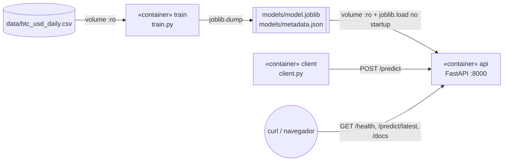

# Atividade Semana 10 Módulo 07
**Nome:** Nicolli Venino Santana

## Contexto e Primeiras Decisões:

O objetivo da atividade foi construir uma solução conteinerizada para treinar um modelo para estimar o valor futuro de uma moeda (escolhi o Bitcoin em dolar, pois foi a moeda que mais encontrei material de trabalho) a partir de dados históricos. Nesse sentido, o modelo treinado foi disponibilizado em um segundo container, com um backend em Python que o carrega e responde às demandas de predição.

Antes de começar o desenvolvimento, escrevi em um docs algumas decisões e fiz a seguinte tabela para esclarecê-las:

| O que | Minha decisão | Justificativa |
|---|---| --- |
| Moeda | BTC-USD | Foi e moeda que mais encontrei material de estudo.
| Fonte | Bitstamp, diário, via [CryptoDataDownload](https://www.cryptodatadownload.com/cdd/Bitstamp_BTCUSD_d.csv) | O Yahoo Finance respondeu `HTTP 429 Too Many Requests` no teste de conexão então por isso eu usei o CSV diário da Bitstamp no CryptoDataDownload, que respondeu `200 OK` e não precisou de API key.
| Banco de dados | arquivo CSV: `data/btc_usd_daily.csv` (4.328 dias, de 2014-11-28 a 2026-10-04) | Por questão de tempo, o orientador recomendou essa abordagem no começo da atividade.
| Frequência | diária | Achei um tempo bom de trabalhar, não precisam ser tantos dados, como seria se fosse em segundos, e consigo ter bons registros.
| Horizonte | 1 dia (preço de fechamento do dia seguinte) | Achei um tempo bom de trabalhar, não precisa ser rápido como se seria se fosse em segundos mas achei que traz uma predição bacana para essa atividade.
| Período usado no modelo | 2018-01-01 em diante | dados que encontrei
| Divisão treino/teste | cronológica, 80/20, sem embaralhar | achei mais eficiente para não ter vazamento de dados e ter uma divisão maior para treino.

## A solução funciona como:

### Arquitetura

Escrevi em um docs e fiz um rascunho no Draw.io e depois pedi para o Claude lapidar.

#### Diagrama de Rascunho no Draw.io:


#### Diagrama Lapidado com IA:



**Como meu modelo chega ao container de inferência:** o container train grava o artefato na pasta ./models do host e o container api monta essa mesma pasta como somente leitura (`./models:/app/models:ro`) e carrega model.joblib ao iniciar. Vale destacar que do jeito que desenvolvi, o artefato não vai ser copiado para dentro da imagem da API, de modo que, se o modelo for treinado de novo, basta reiniciar a API para ela usar a versão nova (não precisa de rebuild). Por fim, o arquivo docker-compose.yml garante a ordem com depends_on: condition: service_completed_successfully, ou seja, a API só sobe depois que o treino terminou com sucesso : )

### Estrutura do repositório

```
├── data/btc_usd_daily.csv      # "banco de dados" (CSV)
├── common/features.py          # engenharia de atributos compartilhada (treino e API)
├── training/                   # container de treinamento
│   ├── Dockerfile
│   ├── requirements.txt
│   └── train.py
├── backend/                    # container de inferência (Python/FastAPI)
│   ├── Dockerfile
│   ├── requirements.txt
│   └── app.py
├── client/                     # aplicação cliente (Python/requests)
│   ├── Dockerfile
│   └── client.py
├── models/                     # artefato gerado (model.joblib + metadata.json)
├── docs/arquitetura.md         # diagramas UML
├── docs/evidencias/            # saídas reais dos comandos executados
└── docker-compose.yml
```

### Modelo

- **Alvo:** log-retorno do dia seguinte, ln(close[t+1] / close[t]). O preço previsto é close[t] * exp(pred). Essa decisão foi em razão que, prever o retorno, e não o preço absoluto, evita que o modelo precise extrapolar preços que nunca viu.
- **Atributos** (13, calculados só com o preço de fechamento numa janela de 30 dias): log-retornos defasados de 1 a 7 dias, média dos retornos em 7 e 30 dias, volatilidade (desvio padrão) em 7 e 30 dias e a distância do preço até as médias móveis de 7 e 30 dias.
- **Candidatos:** Ridge (com StandardScaler) e GradientBoostingRegressor, comparados com o baseline Naive. Essas minhas escolhas se justificam por serem realmente muito simples e serem as técnicas que eu mais vi durante esse módulo nas aulas.
- **Seleção:** menor MAE em US$ no conjunto de teste. O modelo vencedor é treinado de novo com todo o histórico antes de ser exportado. A escolha do MAE também foi em razão da simplicidade e por eu ter visto nas aulas.
- **Formato do artefato:** joblib, um pipeline scikit-learn, mais metadata.json com as métricas, os períodos e a lista de atributos.

### Endpoints do backend

| Método | Rota | Descrição |
|---|---|---|
| GET | `/health` | verificação de vida (`{"status":"ok","model_loaded":true}`); também usada pelo `HEALTHCHECK` do Docker |
| GET | `/model` | metadados do modelo carregado (métricas, períodos, atributos) |
| POST | `/predict` | recebe `{"closes": [...≥31 fechamentos], "last_date": "YYYY-MM-DD"}` e devolve o fechamento previsto para o dia seguinte |
| GET | `/predict/latest` | lê os últimos 31 dias do CSV e prevê o dia seguinte ao último registro |
| GET | `/docs` | Swagger UI, gerada pelo FastAPI |

### Como reproduzir

Pré-requisito: Docker com Docker Compose. 

```bash
# 1. treina o modelo (container train) e sobe a API (container api)
docker compose up --build -d
#    se a porta 8000 estiver ocupada:  API_PORT=8080 docker compose up --build -d
#    (no PowerShell:  $env:API_PORT=8080; docker compose up --build -d)

# 2. confere status e logs
docker compose ps -a
docker compose logs train
docker compose logs api

# 3. testa a API
curl http://localhost:8000/health
curl http://localhost:8000/predict/latest
# navegador: http://localhost:8000/docs

# 4. roda a aplicação cliente
docker compose --profile client run --rm client

# (opcional) treina de novo e recarrega o modelo na API
docker compose run --rm train && docker compose restart api

# 5. derruba tudo
docker compose down
```

### Limitações que percebi depois do desenvolvimento

- O modelo não supera o Naive, já que no teste (2025-01-01 a 2026-10-03), o Ridge teve MAE de US$ 1.406,06 contra US$ 1.399,45 do Naive conforme minha análise e anotação, e acertou a direção em 49,4% dos dias, o que equivale a um cara ou coroa. Dessa forma, a previsão tende a ficar muito próxima do último preço.
- O modelo só usa o preço de fechamento. O volume foi descartado porque as colunas de volume do CSV de origem aparecem invertidas em parte do histórico (vou documentar isso melhor no devlog).
- O CSV é um retrato estático, baixado em 2026-10-05. Para prever dias novos é preciso atualizar o CSV e treinar de novo. Não há coleta automática.
- O horizonte é fixo em 1 dia, e não há intervalo de confiança.
- Não tive tempo de desenvolver autenticação na API e nem limite de requisições, mas documento isso como passos futuros.

## Devlog:

### 1. Entendimento e decisões iniciais

- Li o enunciado no repositório enviado e tomei algumas decisões, como qual moeda prever, qual fonte de dados usar (documentadas na primeira seção desse README).
- Pensei na reprodutibilidade e decidi rodar tudo em containers, tanto o treino, quanto a API e cliente.
- De ferramentas eu usei pandas, scikit-learn e joblib no treino, FastAPI e Uvicorn no backend e escolhi o FastAPI porque ele valida o JSON de entrada com Pydantic.
- Esbocei o UML antes de codar em um docs e como um rascunho no draw.io e depous em ([`docs/arquitetura.md`](docs/arquitetura.md)).

### 2. Preparação dos dados

```bash
curl -sL -o bitstamp.csv https://www.cryptodatadownload.com/cdd/Bitstamp_BTCUSD_d.csv
```

O arquivo bruto tem uma linha de cabeçalho extra (a URL do site), vem em ordem decrescente e inclui o candle parcial do dia do download (2026-10-05). Eu limpei com `awk`/`sort`: removi a primeira linha, converti a data para `YYYY-MM-DD`, ordenei de forma crescente e descartei o dia parcial. Resultado: `data/btc_usd_daily.csv` com 4.328 linhas, de 2014-11-28 a 2026-10-04, sem datas duplicadas.
- **Dificuldade:** nas linhas antigas, as colunas `Volume BTC` e `Volume USD` aparecem trocadas, então como não dava para confiar no volume, acabei usando só o fechamento.

### 3. Engenharia de atributos e treino

- Criei `common/features.py`, que é copiado para as duas imagens (treino e API). Assim a API calcula os atributos exatamente como no treino e evita o problema de training/serving skew. Por isso o build context do compose é a raiz do repositório. Comecei o período em 2018 para não dar peso ao regime de preços de 2014-2017, que era muito diferente. Fiz uma divisão é cronológica (80/20), de modo a deixar treino de 2018-01-01 a 2024-12-31 (2.557 linhas) e teste de 2025-01-01 a 2026-10-03 (640 linhas).Vale comentar que, na primeira execução, o Naive mostrava "acerto de direção = 0,0%" e percebi que isso acontecia porque ele prevê retorno 0, e sign(0) nunca é igual ao sinal do retorno real. Depois dessa análise, eu corrigi para exibir n/a nesse caso, já que a métrica não se aplica. Além disso, o metadata.json chamava de train_period o período usado no retreino final, então eu separei em train_perid e final_fit_period (todo o histórico usado no modelo exportado).

Saída do treino ([`docs/evidencias/01_treinamento.txt`](docs/evidencias/01_treinamento.txt)):

```
[dados] 4328 linhas de 2014-11-28 a 2026-10-04
[split] treino 2018-01-01 -> 2024-12-31 (2557 linhas)
[split] teste  2025-01-01 -> 2026-10-03 (640 linhas)
[avaliação] métricas no conjunto de teste (preço do dia seguinte):
  naive_last_close   MAE=$ 1,399.45  RMSE=$ 1,977.00  MAPE=1.596%  acerto direção=n/a
  ridge              MAE=$ 1,406.06  RMSE=$ 1,985.39  MAPE=1.603%  acerto direção=49.38%
  gradient_boosting  MAE=$ 1,424.42  RMSE=$ 2,003.10  MAPE=1.620%  acerto direção=47.97%
[seleção] melhor modelo por MAE: ridge
[export] models/model.joblib e models/metadata.json salvos
```

Leitura dos resultados: nenhum modelo superou o Naive, de modo que o erro médio fica em torno de 1,6% do preço, praticamente igual a dizer "amanhã = hoje". O Ridge foi exportado por ter o menor MAE entre os modelos treinados e eu mantive o resultado honesto em vez de forçar ajustes que provavelmente gerariam overfitting no período de teste.

### 4. Backend de inferência

- backend/app.py (FastAPI) carrega models/model.joblib no startup, pelo lifespan, e expõe /health, /model, /predict e /predict/latest. O Dockerfile tem um HEALTHCHECK que chama /health, e o serviço client só roda quando a API está healthy. Paralelamente, tomei cuidado para que as versões de scikit-learn, numpy e joblib são idênticas nos requirements.txt do treino e da API, porque um joblib gerado com uma versão do sklearn pode não carregar em outra.

### 5. Integração: dificuldades e correções

1. O primeiro problema na parte de Docker que encontrei foi a porta 8000 ocupada, de modo que meu primeiro comando de docker compose up falhou com:
   ```
   Bind for 0.0.0.0:8000 failed: port is already allocated
   ```
   Isso porque, percebi logo de cara, eu estava usando a porta 8000 com o projeto do módulo, então, ao invés de pará-lo, pensei como solução além deixar a porta do host configurável no compose com "${API_PORT:-8000}:8000". Com essa solução, o padrão continua 8000, e aqui rodei com API_PORT=8080.
2. O log "modelo carregado" não aparecia no meu docker compose logs api. O motivo era o stdout do Python em buffer dentro do container. Adicionei ENV PYTHONUNBUFFERED=1 aos Dockerfiles e precisei da ajuda do Claude para pensar nessa solução.
3. Aviso de depreciação: @app.on_event("startup") está deprecated no FastAPI, então troquei por lifespan, também como uma sugestão do Claude e deu certo!

Execução final ([`docs/evidencias/02_compose_up.txt`](docs/evidencias/02_compose_up.txt)):

```
$ API_PORT=8080 docker compose up --build -d
 Container atividade_semana_10_m07-train-1 Started
 Container atividade_semana_10_m07-train-1 Exited
 Container atividade_semana_10_m07-api-1 Started

$ docker compose ps -a
SERVICE   STATUS                      PORTS
api       Up 12 seconds (healthy)     0.0.0.0:8080->8000/tcp, [::]:8080->8000/tcp
train     Exited (0) 13 seconds ago

$ docker compose logs api
INFO:     Started server process [1]
INFO:     Waiting for application startup.
[startup] modelo 'ridge' carregado de models/model.joblib
INFO:     Application startup complete.
```

Esse log mostra a ordem esperada: `train` termina com código 0, e só então a `api` sobe e carrega o artefato do volume.

### 6. Próximos passos possíveis

- Testar atributos externos (volume de uma fonte confiável, índices de mercado) e modelos de série temporal (ARIMA, LSTM).
- Fazer validação walk-forward, em vez de um único split.
- Atualizar o CSV automaticamente por API (Binance ou CoinGecko) e retreinar de forma agendada.
- Versionar os artefatos (por exemplo, models/<timestamp>/) e permitir que a API escolha a versão.