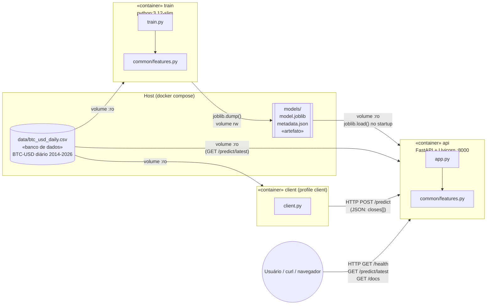
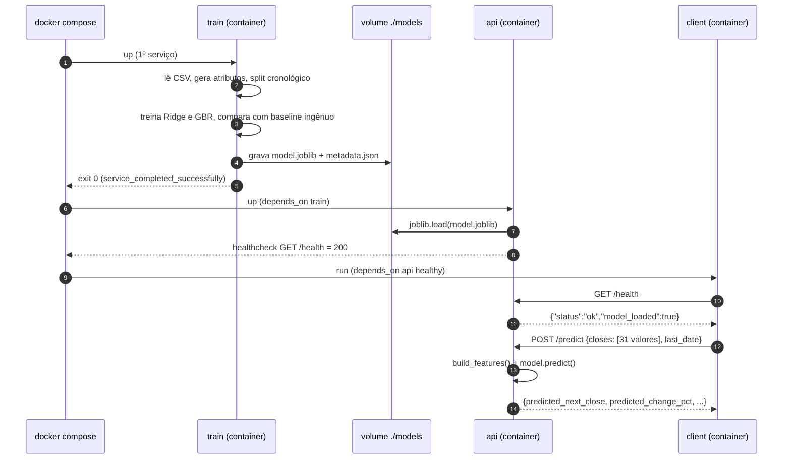
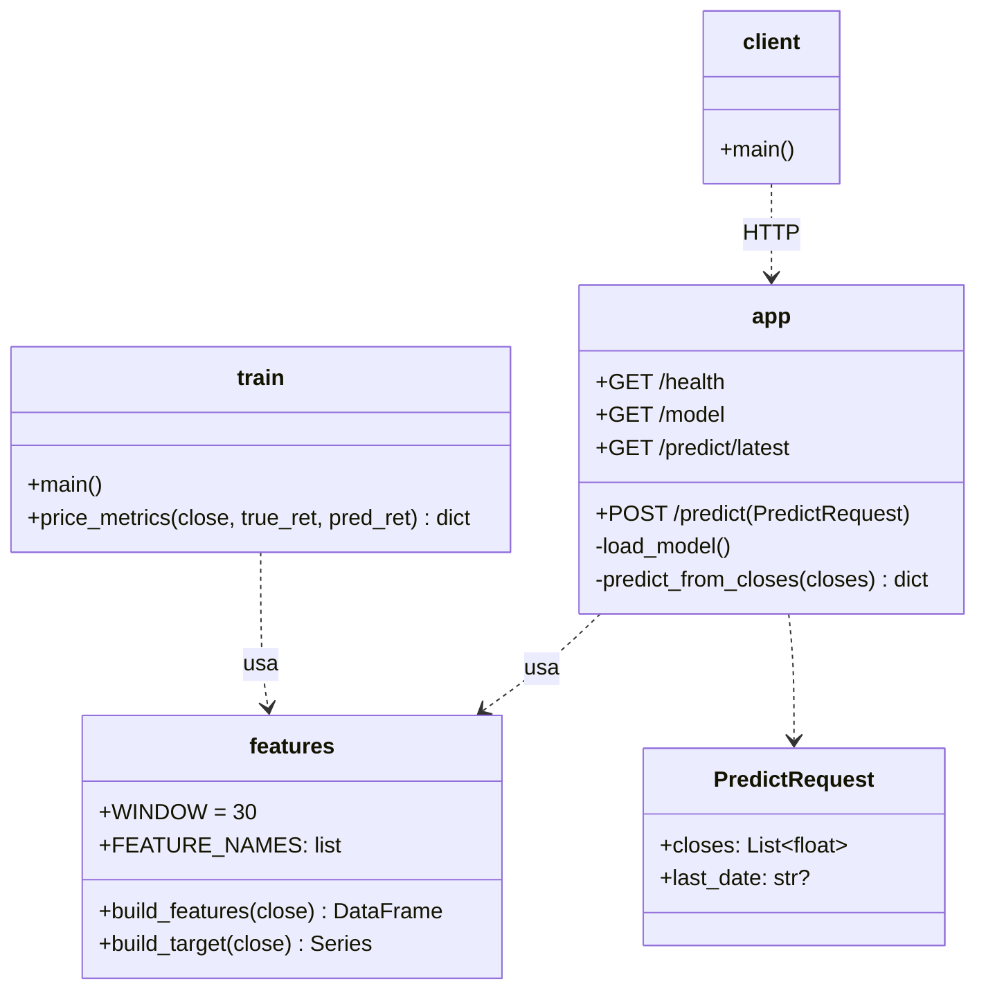

# Arquitetura (UML)

## Diagrama de componentes

Mostra os quatro componentes exigidos (ambiente de treinamento, artefato, container de inferência e aplicação cliente) e como o modelo chega ao container de inferência: pelo **volume compartilhado `./models`**.

## Diagrama de sequência

## Diagrama de classes / módulos (simplificado)

